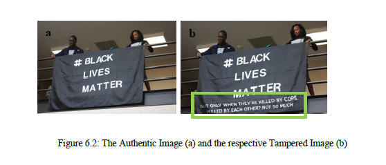
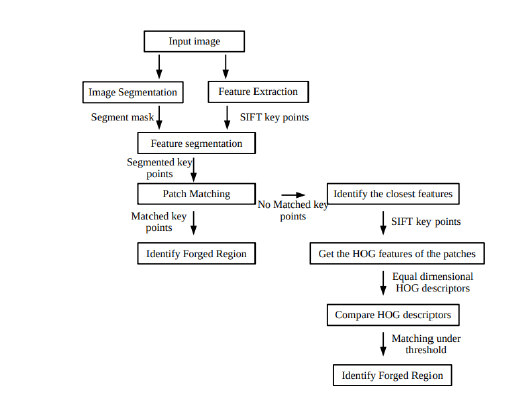

# Image-Forensics

In the present society, editing and tampering of a digital image has become much easier with the rapid development of digital image processing technologies and the popularity of the digital cameras. Even an inexperienced person can easily adopt to these technologies and perform image forgeries with the aid of user friendly software. 
Cloning, Splicing, Resampling, Image Splicing and use of filters to smoothen and sharpen an image have become the most common forgery types that could manipulate images in a way that is very hardly to perceive by naked human eye. Hence it is very important to detect these above mentioned image forgery types.
In addition digital images play a vital role in many different areas such as criminal and forensic investigation, military, journalism and etc. Therefore in order to avoid this critical situation, Image Forgery Detection system will be developed considering various aspects of Image Forgeries.

## Types of forgery detected 
-cloning 
-resampling
-splicing 

### The objectives of this project
- Review and understand the literature that is published under Digital Image Forgery Detection.
- Develop fully functional modules to detect image forgery occurred with Image Cloning, Re-Sampling, Splicing and using Smoothing and Sharpening Filters.
- Finding the relevant datasets.
- Test Accuracy with the different approaches that are taken under same Image Forgery Type.

